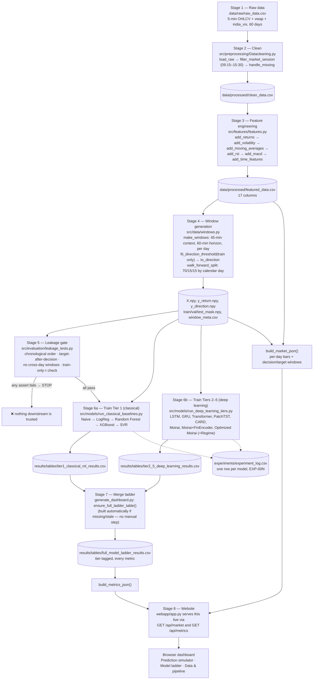
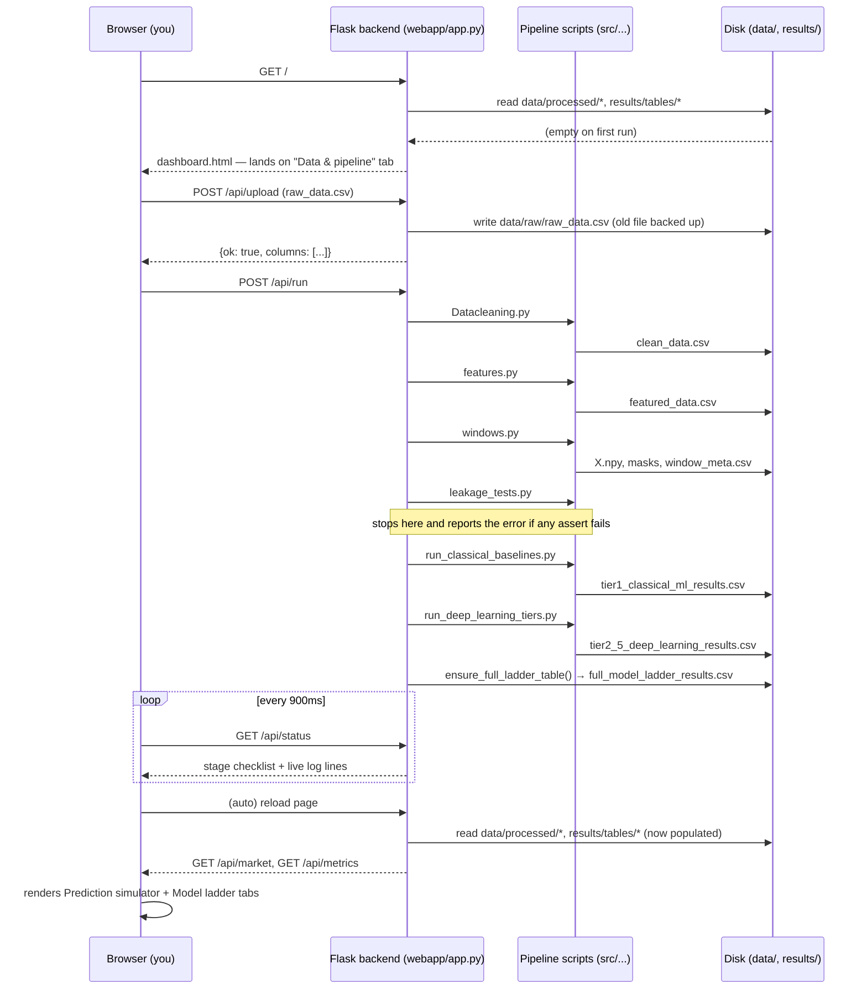

# Optimized Moirai — Intraday Financial Forecasting

A five-tier model ladder for 60-minute-ahead direction forecasting on 5-minute
intraday bars — **Naive → Logistic Regression → Random Forest → XGBoost → SVR
→ LSTM → GRU → Transformer → PatchTST → CARD → Moirai → Optimized Moirai** —
plus a website that turns the pipeline's output into an interactive
prediction simulator and model comparison dashboard.

This README covers two things: **how the pipeline's data flows from raw CSV
to trained models**, and **how the website sits on top of it**.

---

## 1. Data flow — raw CSV to trained models

Everything downstream is deterministic given `data/raw/raw_data.csv` and a
fixed seed (`SEED = 42`). Each stage reads the previous stage's output from
disk and writes its own; nothing is passed in memory between stages, which
is what lets the website re-run any stage independently and lets
`generate_dashboard.py` / `webapp/app.py` rebuild dashboard data from disk at
any time.



**The one rule enforced at every stage:** anything computed from training
data (scaler stats, the direction threshold τ, model weights) is fit once on
`train` and only ever *applied* — never refit — to `val`/`test`. Stage 5
exists specifically to catch violations of this before any model sees the
data.

---

## 2. The website — how a browser click turns into a pipeline run

The website (`webapp/`) doesn't add a second copy of any pipeline logic. It
imports `build_market_json` / `build_metrics_json` / `ensure_full_ladder_table`
directly from `src/visualization/generate_dashboard.py`, and it runs Stages
2–6 as real subprocesses — the same commands you'd type in a terminal.



---

## 3. Directory structure

```
Computational-Finance-research-paper/
├── data/
│   ├── raw/raw_data.csv                 # Stage 1 — only real input; replace to use new data
│   └── processed/                       # Stages 2–4 output (regenerated by the pipeline)
├── src/
│   ├── preprocessing/Datacleaning.py    # Stage 2
│   ├── features/features.py             # Stage 3
│   ├── data/windows.py                  # Stage 4
│   ├── evaluation/leakage_tests.py      # Stage 5 (hard gate)
│   ├── models/
│   │   ├── run_classical_baselines.py   # Stage 6a — Tier 1
│   │   ├── run_deep_learning_tiers.py   # Stage 6b — Tiers 2–5
│   │   ├── architectures.py             # LSTM/GRU/Transformer/PatchTST/CARD/Moirai classes
│   │   └── common.py                    # shared train/evaluate loop for Tiers 2–5
│   └── visualization/
│       ├── generate_dashboard.py        # Stage 7/8 — merges ladder table, builds dashboard JSON
│       └── dashboard_template.html      # used by generate_dashboard.py for a static export
├── results/
│   ├── tables/                          # per-tier + merged model ladder CSVs
│   └── dashboard/                       # static HTML export (optional, see below)
├── experiments/experiment_log.csv       # one row per trained model, auto-incrementing EXP-00N
└── webapp/                              # the website
    ├── app.py                           # Flask backend — see section 2
    ├── templates/dashboard.html         # the entire frontend: 3 tabs, one page
    └── requirements.txt                 # just Flask
```

---

## 4. How to run

### Option A — the website (recommended)

```bash
cd Computational-Finance-research-paper
pip install -r requirements.txt          # pandas, numpy, scikit-learn, xgboost, torch
pip install -r webapp/requirements.txt   # Flask
python webapp/app.py
```

Open **http://localhost:5000/**. Three tabs, one page:

- **Prediction simulator** — step or play through any of the 60 trading
  days, watch a chosen model call the next 60 minutes at every 5-minute
  decision point, and see it resolve correct/wrong against the real label.
- **Model ladder** — direction accuracy, F1, MASE, latency, and CRPS/coverage
  for the Moirai family, across all 13 models.
- **Data & pipeline** — upload a new `raw_data.csv` and run Stages 2–6 from
  the browser, with a live stage checklist and log console. The page reloads
  itself when the run finishes.

If `data/processed/` and `results/tables/` are already populated (true for
this zip as delivered), the first two tabs work immediately. If they're
empty, the site lands on the "Data & pipeline" tab automatically.

### Option B — command line, stage by stage

```bash
cd Computational-Finance-research-paper
python src/preprocessing/Datacleaning.py
python src/features/features.py
python src/data/windows.py
python src/evaluation/leakage_tests.py         # stop if this fails
python src/models/run_classical_baselines.py
python src/models/run_deep_learning_tiers.py
python src/visualization/generate_dashboard.py # writes results/dashboard/intraday_direction_ladder.html
```

The last command produces a single self-contained HTML file you can open
directly, email, or archive — no server needed. It's a snapshot at the time
you ran it; the website (Option A) always reflects whatever's on disk right
now.

---

## 5. About the dataset

`data/raw/raw_data.csv` is **synthetic**, not real market data — see
`README_dataset.md` for what it reproduces and where to get real NSE Nifty-50
minute data instead. No code changes are needed to swap it in: keep the same
column names (`timestamp, open, high, low, close, volume, ...`) and either
replace the file directly or upload it through the "Data & pipeline" tab.
